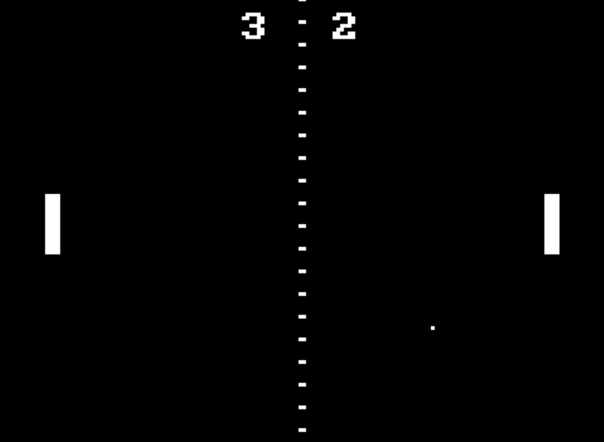

# JDH-8
An fully custom 8-bit minicomputer with a unique architecture and the express goal of playing PONG.



The program above is running in the emulator, see [`programs/pong.asm`](programs/pong.asm) for the source.

[See the video on the design](https://youtu.be/7A1SzIIKMho).

## Machine Description

### Features
- 8-bit data width
- 16-bit address bus (64 KiB available memory + banking)
- 8 fully general purpose registers (5 normal + 2 indirect address + 1 flags)
- 16 instruction RISC architecture
- Port mapped I/O for device communication

### Instruction Set:
```
0: MW   reg, imm8/reg   -> reg = imm8/reg
1: LW   reg, [HL/imm16] -> reg = [HL/imm16]
2: SW   [HL/imm16], reg -> [HL/imm16] = reg
3: PUSH imm8/reg        -> [SP--] = imm8/reg
4: POP  reg             -> reg = [++SP]
5: LDA  [imm16]         -> HL = imm16
6: JNZ  imm8/reg        -> imm8/reg != 0 ? PC = HL : NOP
7: INB  reg, imm8/reg   -> reg = PORT[imm8/reg]
8: OUTB imm8/reg, reg   -> PORT[imm8/reg] = reg
9: ADD* reg, imm8/reg   -> reg = reg + imm8/reg
A: ADC* reg, imm8/reg   -> reg = reg + imm8/reg + c
B: AND  reg, imm8/reg   -> reg = reg & imm8/reg
C: OR   reg, imm8/reg   -> reg = reg | imm8/reg
D: NOR  reg, imm8/reg   -> reg = ~(reg | imm8/reg)
E: CMP* reg, imm8/reg   -> reg = reg + imm8/reg
F: SBB* reg, imm8/reg   -> reg = reg - imm8/reg - b

*these instructions load the carry/borrow bits in the (F)lags register
```

### Registers
```
A (0): GP register/arg 0
B (1): GP register/arg 1
C (2): GP register/arg 2
D (3): GP register/arg 3
L (4): GP register/(L)ow index register
H (5): GP register/(H)igh index register
Z (6): GP register/return value
F (7): flags (LSB to MSB)
    LESS
    EQUAL
    CARRY
    BORROW
```

See [the spec](SPEC.txt) for more information.

## Toolchain
### **Assembler** ([`asm`](./asm))
`./bin/asm [-h] [--help] [-v] [--verbose] [-n] [--no-builtin-macros] [-o file] file`

### **Emulator** ([`emu`](./emu))
`./bin/emu [-m/--mod module] [-r/--run] [-l/--load file address] [ROM file]`
#### Commands
- `SET <register> <data>`: set register data
- `GET <register>`: get register value
- `PEEK <address>`: get memory value
- `POKE <address> <data>`: set memory data
- `INB <port>`: get port data
- `OUTB <port> <data>`: write port data
- `STEP`: step one instruction
- `DUMP`: print current machine state
- `LOAD <ROM file> <address>`: load ROM at address
- `MODS`: list modules
- `MOD <module>`: load module
- `DEVICES`: list devices
- `RUN <speed?>`: run at speed (hz) until halt
- `QUIT`: quit
